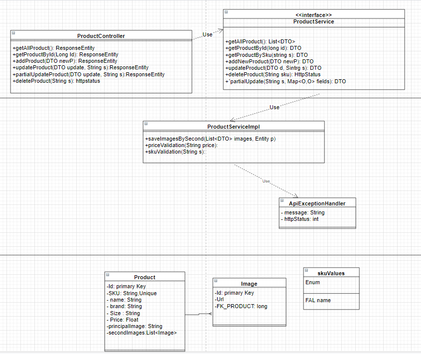

# CRUD Challenge
## Stack tecnologico:
- Java 11
- Apache Maven 3.8.1
- Springboot 2.5.5
- H2 Database
- Lombok

# Diagrama de Clases UML



# GUIA INSTALACION
## Herramientas requeridas
- Java 11+
- Intelijj, Eclipse o cualquier otro IDE
- maven

## En caso que no tengas ninguna herramienta :
Instalación de Java, Eclipse y Maven embebido
Lista de reproducción - https://www.youtube.com/playlist?list=PLBBog2r6uMCSmMVTW_QmDLyASBvovyAO3
Pasos
- 0 - Visión general - Instalación de Java, Eclipse y Maven
- 1 - Instalación de Java JDK
- 2 - Instalación de Eclipse IDE
- 3 - Uso de Maven incrustado en Eclipse
- 4 - Solución de problemas de Java, Eclipse y Maven


Se debe clonar el repositorio desde gitHub, colocarse en una carpeta del disco
por ejemplo "Documents" y clonar usando el comando:

```shell script
git clone https://github.com/tavomtorres/SpringBootCrud.git
```
una vez clonado abrir desde cualquier IDE con las herramientas anteriores

y correr el archivo ChallengecrudApplication como "Run as Application"

## Solución de problemas de instalación
- Node JS y NPM
https://docs.npmjs.com/common-errors
https://docs.npmjs.com/getting-started/troubleshooting
- Código de Visual Studio
https://code.visualstudio.com/docs/supporting/errors
https://code.visualstudio.com/docs/supporting/FAQ
- Eclipse y Maven embebido
PDF : https://github.com/in28minutes/SpringIn28Minutes/blob/master/InstallationGuide-JavaEclipseAndMaven_v2.pdf
Repositorio GIT para la instalación : https://github.com/in28minutes/getting-started-in-5-steps


# ENDPOINTS y Ejemplos

### GET /products HttpStatusCodes: 200, 404
- http://localhost:8080/api/v1/products
Retorna los productos en la bd.

### GET /products/{id} HttpStatusCodes: 200, 404
- http://localhost:8080/api/v1/products/1
Retorna el producto por numero de Id

### GET /products/sku/{SKU} HttpStatusCodes: 200 , 404
- http://localhost:8080/api/v1/products/FAL-1000000
  Retorna el producto por SKU

### POST /products/ HttpStatusCodes: 201 , 409 
- http://localhost:8080/api/v1/products
  Crea un nuevo producto en la bd
```json
{
        "SKU": "FAL-7221000",
        "name": "Product Prueba",
        "brand": "Prueba",
        "size": "L",
        "price": 12.00,
        "principalImage": "https://falabella.scene7.com/is/image/Falabella/POST.png",
        "otherImages": [
            {
                "url": "https://falabella.scene7.com/is/image/Falabella/post1"
            },
            {
                "url": "https://falabella.scene7.com/is/image/Falabella/post2"
            },
            {
                "url": "https://falabella.scene7.com/is/image/Falabella/post3"
            },
            {
                "url": "https://falabella.scene7.com/is/image/post4"
            }
        ]
    }
```

### PUT /products/{SKU} HttpStatusCodes: 200 , 400 
- http://localhost:8080/api/v1/products/FAL-3000000
  Modifica un producto * se debe mandar todo el json del objeto.

```json
{
  "name": "Producto 3",
  "brand": "Modificado2",
  "size": "100 m",
  "price": "576.21",
  "principalImage": "https://falabella.scene7.com/is/image/Falabella/ImagenModificada.jpg",
  "otherImages": [
    {
      "url": "https://falabella.scene7.com/is/image/imagenModificada.png"
    }
  ]
}
```

### PATCH /products/{SKU} HttpStatusCodes: 200 , 400 , 404
- http://localhost:8080/api/v1/products/FAL-2000000
  Modifica solo el campo o los campos que se le indiquen en el cuerpo del request por ejemplo:

```json
{
  "name": "Nombre Modificado"
}
```


```json
{
  "name": "Modificado",
  "brand": "Brand modificada",
  "size": "1000"
}
```

### DELETE /products/{SKU}  HTTPSTATUSCODES: 200 , 404
Retorna HTTP status 200 OK si se elimina con exito, si no se encuentra el SKU devuelve 404
NOT FOUND

# H2 Console
- http://localhost:8080/h2
- Use jdbc:h2:mem:testdb as JDBC URL
- User : sa
- password : sa


